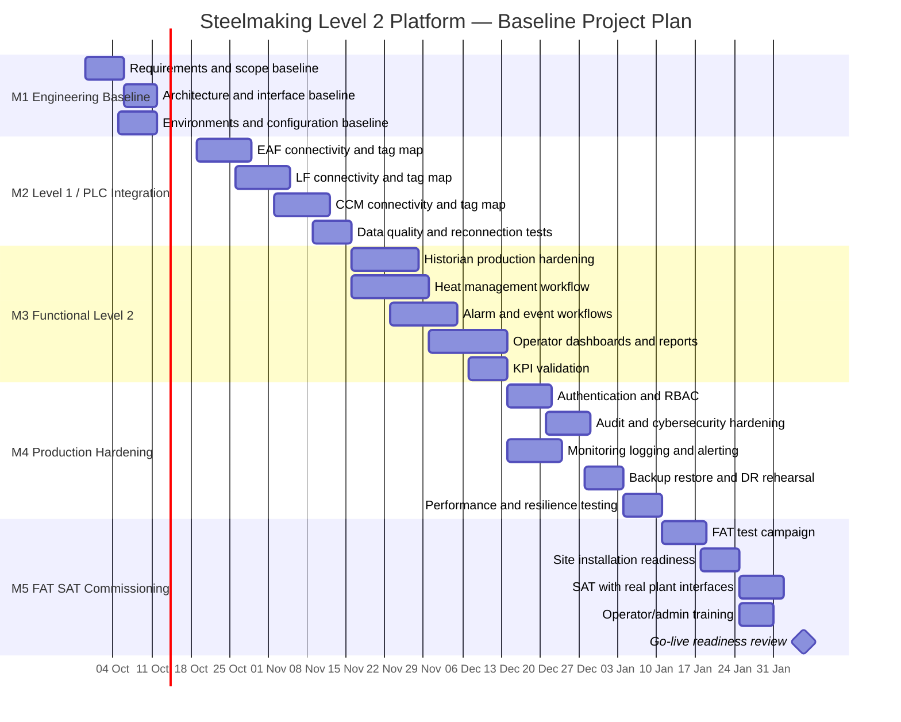

# Steelmaking Level 2 — Gantt Plan

> Baseline schedule only. No task below is marked as completed.

## Scheduling rules

- Dates are planning targets, not completion claims.
- Dependencies should be updated when plant interface information becomes available.
- Any scope change affecting a milestone target should be logged in the decision/change register.
